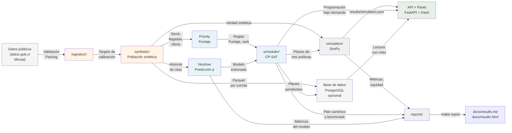

> **Herramienta de investigación con datos sintéticos. No usar para decisiones clínicas ni de gestión real sin validación institucional.**

# Prioriza

Sistema de apoyo a la gestión de listas de espera hospitalarias en Chile. Integra tres componentes:

1. **Priorización transparente**: un puntaje por paciente basado en reglas explícitas (prioridad clínica declarada, tiempo de espera, plazos de garantías GES), auditable y explicable.

2. **Predicción de inasistencias**: modelo de scikit-learn (con la calibración evaluada contra la versión sin calibrar) que estima la probabilidad de que un paciente no se presente a su cita o cirugía.

3. **Programación óptima**: modelo de OR-Tools CP-SAT que asigna pacientes a cupos (pabellones, horas de especialista) respetando capacidades y plazos, y usa la probabilidad de inasistencia para sobreagendar de forma controlada.

Un **simulador** SimPy compara políticas (orden de llegada, solo prioridad, optimizada) a lo largo de semanas, y una **API** FastAPI + **panel** Dash muestran todos los resultados, con flujo de revisión: todo plan nace pendiente; solo un revisor lo aprueba o rechaza; solo un gestor lo marca vigente.

## Por qué importa

Al 30 de septiembre de 2025, el sistema público de Chile registraba **2.576.371 interconsultas para consulta nueva de especialidad** (2.134.364 personas, mediana **242 días**) y **417.561 intervenciones quirúrgicas** (mediana **264 días**) en espera no GES, además de **80.022 garantías GES retrasadas** (Glosa 06, III trimestre 2025, Minsal). Prioriza muestra cómo ordenar y programar mejor con la misma capacidad, y cuantifica la ganancia con simulación.

## Arquitectura



El flujo comienza con datos públicos agregados, genera una población sintética calibrada, la prioriza según reglas transparentes, predice inasistencias, programa con optimización matemática y simula políticas completas. Los resultados se muestran en un panel interactivo con flujo de revisión humana (pendiente → aprobado → vigente).

## Demo en unos minutos

Lo primero útil: sigue estos pasos para ver el sistema completo funcionando localmente.

### Requisitos

- **Git**
- **`uv`** (gestor de paquetes Python e instalador de Python): instálalo en macOS/Linux con

  ```bash
  curl -LsSf https://astral.sh/uv/install.sh | sh
  ```

  En Windows, sigue las instrucciones en [astral.sh/uv/install](https://astral.sh/uv/install).

Eso es todo. No necesitas Docker, PostgreSQL ni instalar Python manualmente.

### Pasos

```bash
# 1. Clonar el repositorio
git clone https://github.com/TheNewAarons/prioriza.git
cd prioriza

# 2. Ejecutar la demo
make demo
```

O directamente con el script:

```bash
scripts/demo.sh
```

### Qué hace

La demo genera una población sintética, entrena el modelo de inasistencias, programa citas con tres políticas, corre una simulación corta que compara cuatro y levanta la API y el panel. Todo queda en `data/demo/` (ignorado por git). Los pasos:

1. **Sincroniza dependencias** con `uv sync` (instala Python 3.12 si falta y crea `.venv` en el proyecto).
2. **Genera la población sintética** (por defecto 10.000 entradas en lista de espera, ajustable con `--size`).
3. **Entrena el modelo de inasistencias**.
4. **Crea usuarios de demostración** (gestor, revisor y lectura) con claves generadas al azar en `data/demo/users.json`.
5. **Programa citas** para 4 semanas con tres políticas: orden de llegada, solo prioridad y optimizada (con sobrecupo controlado).
6. **Simula** 8 semanas con 2 réplicas (ajustable con `--sim-weeks` y `--sim-replicas`) y compara cuatro políticas: las tres anteriores y la optimizada sin sobrecupo.
7. **Levanta el panel interactivo** en `http://127.0.0.1:8050` y la API en `http://127.0.0.1:8000`.

Medido en un Mac con Apple Silicon (8 núcleos), con las dependencias ya descargadas: algo más de 2 minutos en total, 133 s (población 9 s, modelo 45 s, programación 26 s, simulación 46 s, servicios 6 s; medido el 2026-10-09 en un clon nuevo). La primera vez hay que sumar la descarga de dependencias, que depende de la conexión.

### Qué imprime al final

La demo mostrará:

- **URL del panel**: `http://127.0.0.1:8050`
- **URL de la API** (OpenAPI): `http://127.0.0.1:8000/docs`
- **Tres usuarios locales** con su clave (la misma que está en `data/demo/users.json`):
  ```
  gestora.demo (gestor): <clave>     programa planes y los marca como vigentes
  revisor.demo (revisor): <clave>    aprueba o rechaza planes
  lectura.demo (lectura): <clave>    solo consulta
  ```
- Un recorrido sugerido y cómo detenerla.

Las claves son solo para esta demo local: se generan al azar en tu máquina y no sirven en ningún otro lugar.

### Recorrido sugerido

1. Entra con la clave de `gestora.demo` y revisa **Resumen** y **Lista** (elige una fila para ver el desglose del puntaje).
2. En **Programación**, elige una política y pulsa **Programar**; espera a que el trabajo termine.
3. Pulsa **Salir**, entra como `revisor.demo` y, en **Programación**, aprueba el plan.
4. Sal y entra otra vez como `gestora.demo`; pulsa **Marcar como vigente**.
5. Revisa **Simulación** y **Equidad**: los resultados se muestran tal cual, también los desfavorables.

### Opciones útiles

```bash
# Población más chica y rápida (el mínimo es 1.000)
make demo DEMO_ARGS="--size 1000"

# Generar datos nuevos (borra anteriores)
scripts/demo.sh --fresh

# No abrir el navegador automáticamente
scripts/demo.sh --no-open

# Solo generar datos, sin levantar servicios
scripts/demo.sh --no-serve

# Cambiar puertos (API en 9000, panel en 9050)
scripts/demo.sh --api-port 9000 --panel-port 9050

# Ver todas las opciones
scripts/demo.sh --help
```

### Detener la demo

Presiona **Ctrl+C** en la terminal donde corre `make demo`. El script limpiará los procesos automáticamente.

## Cómo funciona el enrutamiento de tiers

El proyecto usa una estrategia de **routing por complejidad** para optimizar precisión y presupuesto de tokens:

| Tier | Esfuerzo / Tarea | Modelo | Ejemplos |
| :--- | :--- | :--- | :--- |
| **Tier 1 (nativo)** | Arquitectura core, optimización, debugging complejo, revisiones críticas | Claude Sonnet / Opus | Diseño del programador CP-SAT, correcciones de seguridad, revisiones finales |
| **Tier 2** | Features estándar, algoritmos, refactorización de componentes, endpoints API | DeepSeek V4 / Qwen | Implementación de la simulación, extensiones de la API |
| **Tier 3** | Tests unitarios, documentación, generación de boilerplate, escaneos | Kimi / Qwen | Tests de determinismo, documentación, escaneos de interfaces |

**Tablero compartido**: `TASK_PLAN.md` centraliza el trabajo. Cada subagente que termina una fase la marca como hecha, añade un log, y deja el contexto preparado para el siguiente.

**Fallbacks reales**: cuando el proxy LiteLLM de Tier 2/3 alcanzó límites de uso (429 "Go usage limit exceeded"), los subagentes del proyecto (`implementer`, `test-writer`, `docs-writer`, `chore`, `Explore`) actuaron como respaldo más cercano a los roles pedidos, según la tabla de `CLAUDE.md`. Todo se registró en el TASK_PLAN.

**Sesión principal**: solo ella commitea, directo en `main` (sin ramas ni PR, ver `docs/version-control.md`). `make lint typecheck test` en verde antes de cada commit; `make hooks` instala pre-commit y pre-push con esos checks.

## Resultados resumidos

Cifras copiadas tal cual de [`docs/results.md`](docs/results.md) (también en
[`docs/results.html`](docs/results.html)); ese informe se genera con `make report` desde `results/*.json` y no
tiene cifras escritas a mano. Son resultados sobre datos sintéticos.

**Programador, plan canónico** (100.000 entradas, 4 semanas desde el 06-10-2025; sección "Priorización", tabla
"Efecto en el plan canónico"):

| Política | Agendadas | Máxima prioridad agendadas | GES cumplidas | GES sin cumplir |
|---|---:|---:|---:|---:|
| Orden de llegada | 13.169 | 844 | 342 | 3.524 |
| Solo prioridad | 13.168 | 4.146 | 1.070 | 2.796 |
| Optimizada | 13.616 | 4.150 | 1.594 | 2.272 |

De 3.866 garantías GES con obligación en el horizonte, ninguna política las cumple todas; el informe detalla las
causas (sin bloque en el horizonte, plazo antes del primer bloque, cupos tomados).

**Modelo de inasistencias** (sección "Modelo de inasistencias"): el modelo principal,
`logistic_regression_uncalibrated`, tiene AUC 0,625 y Brier 0,1205 en el conjunto de prueba, frente a 0,602 y
0,1215 del baseline por especialidad. Con datos sintéticos, estas métricas validan el pipeline, no el desempeño en
pacientes reales.

**Simulación** (10.000 entradas, 26 semanas, 5 réplicas; sección "Simulación", tabla de medias con IC 95 %):

| Métrica | Orden de llegada | Solo prioridad | Optimizada | Optimizada con sobrecupo |
|---|---:|---:|---:|---:|
| Pacientes atendidos | 6.428,4 | 6.482,8 | 6.515,2 | 6.616,0 |
| Mediana de espera de los atendidos (días) | 356,8 | 300,7 | 295,4 | 294,9 |
| Mediana de espera de la lista final (días) | 138,6 | 154,4 | 154,4 | 153,8 |
| GES incumplidas | 1.358,8 | 1.201,4 | 1.034,6 | 1.034,2 |

**Resultado desfavorable que se informa tal cual:** la mediana de espera de quienes siguen en la lista al final es
mayor con solo prioridad y con las optimizadas (154,4 y 153,8 días) que con orden de llegada (138,6). El informe
también muestra, entre otros, los desbordes de las sesiones con sobrecupo y la mayor exposición al sobrecupo del
grupo 0-14 (sección "Equidad").

## Principios

- **Sin datos de pacientes reales**: solo datos públicos agregados (datos.gob.cl, reportes del Minsal) y una población sintética calibrada contra ellos. Nunca se agregan nombres, RUT ni datos clínicos reales.

- **El sistema apoya, no decide**: la prioridad clínica es un dato de entrada definido por profesionales; el sistema nunca la infiere ni la sobreescribe. Todo plan generado requiere revisión humana antes de usarse.

- **Equidad**: el modelo de inasistencias no puede usar atributos protegidos (sexo, etnia, nacionalidad) ni proxies evidentes. Se mide y reporta si el sobreagendamiento perjudica sistemáticamente a algún grupo (comuna, grupo etario, previsión).

- **Transparencia de resultados**: nunca se ocultan resultados negativos. Si una política no mejora en alguna métrica o grupo, se reporta tal cual.

## Seguridad y privacidad

- **Claves estáticas por rol** (gestor, revisor, lectura); sin base de datos de usuarios hoy (investigación).
- **Flujo de revisión humana**: todo plan es `pending` al crearse; solo `revisor` lo aprueba; solo `gestor` lo marca vigente.
- **Auditoría**: registra usuario, rol, decisión, nota y hora de cada acción.
- **Logs sin datos personales**: redacción automática de identificadores de paciente, RUT y claves en todos los registros.
- **Rate limiting**, límites de cuerpo y de parámetros, cabeceras de seguridad en toda respuesta.

Detalles en `[docs/security.md](docs/security.md)`. **Antes de datos reales falta**: proveedor de identidad, TLS, cifrado en reposo, política de retención, revisión legal y validación institucional de los modelos.

## Limitaciones

Los datos son sintéticos y los supuestos no se validan contra cada celda del mundo real. El generador tiene limitaciones conocidas:

- **Granularidad de la oferta**: a 10.000 entradas, solo el 37 % de las celdas de consulta recibe algún bloque en 26 semanas (el 76 % del stock sí).
- **Ley de Little para las llegadas**: no hay estacionalidad, tendencia ni abandono.
- **Sin validación clínica** de los parámetros de inasistencia ni autorización de cambios de política.

Listado completo: `[docs/limitations.md](docs/limitations.md)`.

## Uso avanzado

### Comandos individuales

Desde la raíz del repo, después de `uv sync`:

```bash
# Descargar datos públicos agregados
make ingest

# Generar población sintética (100.000 entradas, seed 42) y cargarla en PostgreSQL
# (requiere la base de `make up` y `make migrate`; sin base usa
#  `uv run --package synthetic prioriza-synth generate --size 100000`)
make synth

# Entrenar el modelo de inasistencias
make train-noshow

# Programar citas (4 semanas, seed 42, tamaño 100.000)
make schedule

# Benchmark del programador (tamaños 1k, 10k, 50k; horizonte 2 y 4 semanas)
make bench-scheduler

# Simular políticas (26 semanas, 5 réplicas)
make simulate

# Ejecutar tests
make test

# Verificar código (linter + formateo)
make lint

# Type checking (mypy)
make typecheck

# Formatear código
make format

# Auditar dependencias (pip-audit)
make audit

# Generar informe (docs/results.md y .html)
make report
```

Personaliza con variables de entorno:

```bash
# Población de 50.000 en lugar de 100.000 (con PostgreSQL)
make synth SIZE=50000

# Seed distinto
make synth SEED=123

# Semanas de programación
make schedule WEEKS=8

# Argumentos de las CLIs
make schedule SCHEDULE_ARGS="--policy priority --time-limit 60"
make simulate SIM_ARGS="--weeks 4 --replicas 3"
```

### Con Docker Compose (opcional)

Si prefieres PostgreSQL persistente y servicios completos en contenedores:

```bash
# Levanta PostgreSQL, API y panel en contenedores
make up

# Ejecuta migraciones de Alembic
make migrate

# Detiene los servicios
make down
```

Configura usuarios en `api/config/users.json` (copiar `api/users.example.json` y llenar claves; el archivo de ejemplo **no tiene claves válidas**).

Variables de entorno opcionales:

```bash
PRIORIZA_API_USERS_FILE=api/config/users.json  # Ubicación del archivo de usuarios
PRIORIZA_API_RUN_DIR=data/synthetic/<run_id>    # Directorio de la corrida sintética
PRIORIZA_API_MODELS_DIR=models/noshow           # Directorio de modelos
PRIORIZA_API_RESULTS_DIR=results                # Directorio de resultados
```

### Desarrollo

Se commitea directo en `main`, un commit por cambio lógico y solo con `make lint typecheck test` en verde; el hook
`pre-push` repite esos chequeos antes de subir (ver [`docs/version-control.md`](docs/version-control.md)).

```bash
# Sincronizar todas las dependencias del workspace
make sync

# Instalar hooks de git (pre-commit, pre-push con lint/typecheck/test)
make hooks

# Formatear y revisar el código
make format
make lint
make typecheck

# Ver todos los targets disponibles
make help
```

## Documentación

- **[docs/data-sources.md](docs/data-sources.md)**: fuentes de datos públicos verificadas, cifras y licencias.
- **[docs/synthetic-data.md](docs/synthetic-data.md)**: descripción de la población sintética, calibración, variables y supuestos.
- **[docs/priority.md](docs/priority.md)**: reglas de priorización explícitas, cálculo del puntaje y tiers de garantía GES.
- **[docs/noshow-model-card.md](docs/noshow-model-card.md)**: modelo de inasistencias, datos de entrenamiento, calibración y equidad.
- **[docs/scheduler-formulation.md](docs/scheduler-formulation.md)**: formulación matemática del programador CP-SAT, fases lexicográficas y sobrecupo.
- **[docs/scheduler-performance.md](docs/scheduler-performance.md)**: benchmark del programador, tiempos y comparación con políticas simples.
- **[docs/simulation-design.md](docs/simulation-design.md)**: diseño del simulador SimPy, métricas y limitaciones.
- **[docs/api.md](docs/api.md)**: referencia de endpoints FastAPI, autenticación, roles y ejemplos.
- **[docs/design.md](docs/design.md)**: diseño visual del panel Dash, tokens y estructura de páginas.
- **[docs/decisions.md](docs/decisions.md)**: decisiones arquitectónicas del proyecto, workspace, dependencias y reproducibilidad.
- **[docs/version-control.md](docs/version-control.md)**: estrategia de ramas, commits y versionado de resultados.
- **[docs/security.md](docs/security.md)**: controles de seguridad implementados y qué falta antes de datos reales.
- **[docs/limitations.md](docs/limitations.md)**: limitaciones consolidadas del generador sintético, modelo, programador y simulación.
- **[docs/results.md](docs/results.md)** / **[docs/results.html](docs/results.html)**: informe completo de resultados con todas las cifras y comparaciones (acceso: `make report`).

## Estructura del monorepo

Workspace `uv` con 9 miembros:

| Módulo | Descripción |
|---|---|
| `shared/` | Configuración, enums, sesiones de BD, utilidades comunes. |
| `ingestion/` | CLI `prioriza-ingest`: descarga datos públicos, parsea PDF, valida. |
| `synthetic/` | CLI `prioriza-synth`: genera población sintética calibrada. |
| `priority/` | Cálculo de prioridad por reglas explícitas. |
| `noshow/` | Modelo de scikit-learn para predicción de inasistencias. |
| `scheduler/` | Asignación con OR-Tools CP-SAT, búsqueda de soluciones óptimas. |
| `simulation/` | Simulador de políticas con SimPy, comparación de estrategias. |
| `api/` | API FastAPI con autenticación, roles y revisión de planes. |
| `dashboard/` | Panel Dash: lista, programación, simulación, equidad. |
| `reports/` | Generación de informes Markdown y HTML con Jinja2. |

## Licencia de datos

Las fuentes de datos públicos se citan en [docs/data-sources.md](docs/data-sources.md). Los PDFs fuente (ej. Glosa 06 del Minsal) **no se redistribuyen** en el repositorio; se usan solo mediante URLs verificadas y SHA256.

Licencias de entrada:
- **Glosas 06 (Minsal)**: no indicada.
- **Estadísticas GES (Superintendencia de Salud)**: no indicada.
- **Catálogo de establecimientos (datos.gob.cl)**: CC0.
- **Literatura**: CC BY-NC 3.0 o similar (ver [docs/data-sources.md](docs/data-sources.md)).

El código y la población sintética generada están sujetos al aviso de investigación con datos sintéticos (ver inicio del README).

---

**Más información**: lee [docs/decisions.md](docs/decisions.md) para la arquitectura completa, o contacta al equipo de desarrollo.
